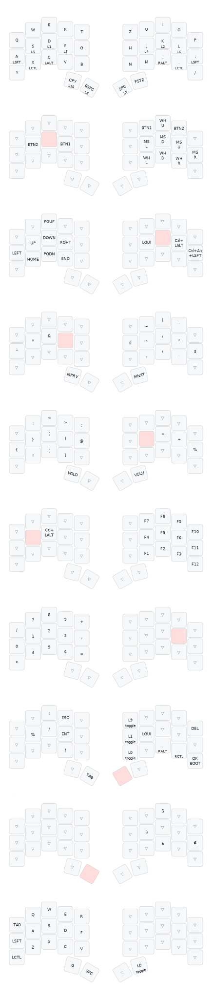

# Personal German Ferris Sweep Keyboard Layout

Based on [Pierre Chevalier's default layout](https://github.com/qmk/qmk_firmware/tree/user-keymaps-still-present/keyboards/ferris/keymaps/default), adapted for German host keyboard layout with additional layers for umlauts and gaming.



## Quick Guide

**Setup:**
```bash
# Install QMK CLI
uv tool install qmk

# Setup QMK (follow prompts, point to this repo)
qmk setup

# Verify installation
qmk doctor
```

Full guide: https://docs.qmk.fm/#/newbs

**Flashing:**
```bash
qmk flash -kb ferris/sweep -km mine -e CONVERT_TO=elite_pi -bl uf2-split-left
qmk flash -kb ferris/sweep -km mine -e CONVERT_TO=elite_pi -bl uf2-split-right
```

**Enter bootloader mode:**
- Keyboard shortcut: Hold right thumb + bottom right pinky (QK_BOOT on Layer 7)
- Bootmagic: Disconnect TRRS cable, hold Q (left) or P (right) while plugging USB into that half
- Physical: Double-tap reset button on Elite-Pi controller

**Note:** After initial setup, only flash the left half (keymap syncs to right automatically)

## Layers (TLDR)

- **Layer 0:** Base QWERTY layer, copy/paste on outer thumbs
- **Layer 1:** Mouse (left middle finger hold) - mouse movement, clicks, scroll
- **Layer 2:** Navigation (right middle finger hold) - arrows, page up/down, home/end
- **Layer 3:** Right symbols (left index hold) - `|`, `~`, `@`, `$`, etc.
- **Layer 4:** Left symbols (right index hold) - brackets `{}[]()`, `!`, `?`, `&`, `+`
- **Layer 5:** Function keys (left ring finger hold) - F1-F12 in numpad layout
- **Layer 6:** Numbers (right ring finger hold) - 0-9 in numpad-like layout with math operators
- **Layer 7:** Always accessible (right thumb hold) - Esc, Tab, Enter, Del, `!`, `?`, layer switching (DF0/DF1/DF9)
- **Layer 8:** German characters (left thumb hold) - umlauts (ä, ü, ö), €, ß
- **Layer 9:** Gaming layer - QWERTY shifted left by one key for easier WASD gaming

## Changes from Default

- Copy/Paste on outer thumb keys instead of 0/1
- All symbols adapted for German keyboard layout (RALT/LSFT combinations)
- Added Layer 8 for German special characters
- Added Layer 9 as gaming layer (access via DF(9) on Layer 7)
